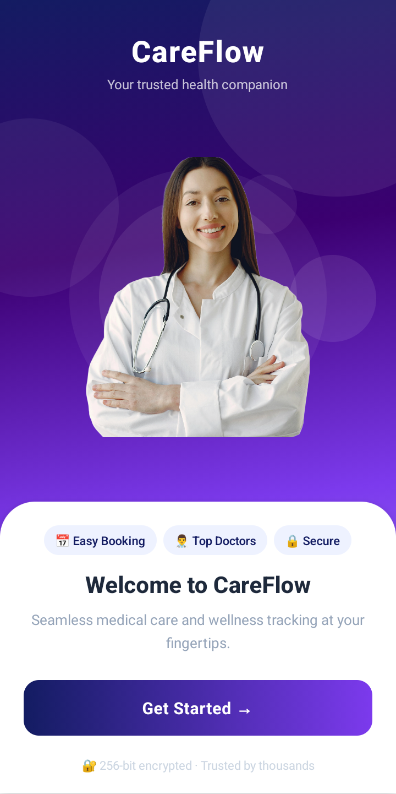
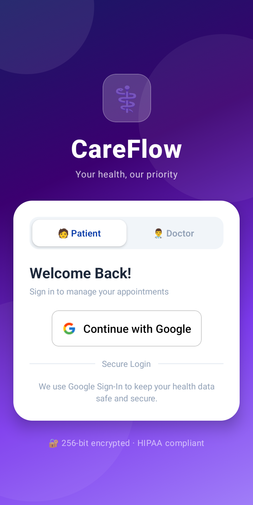
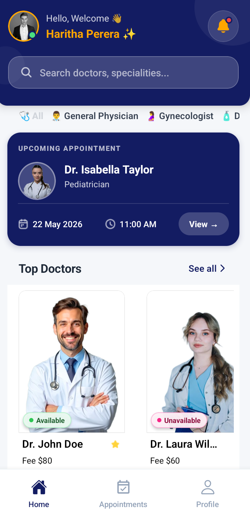
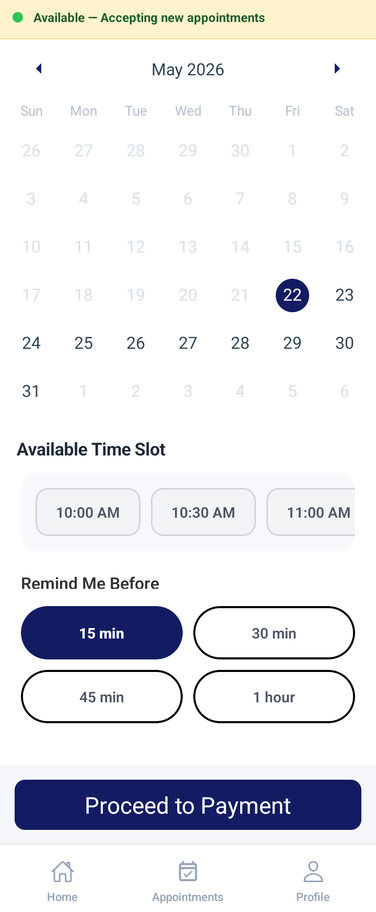
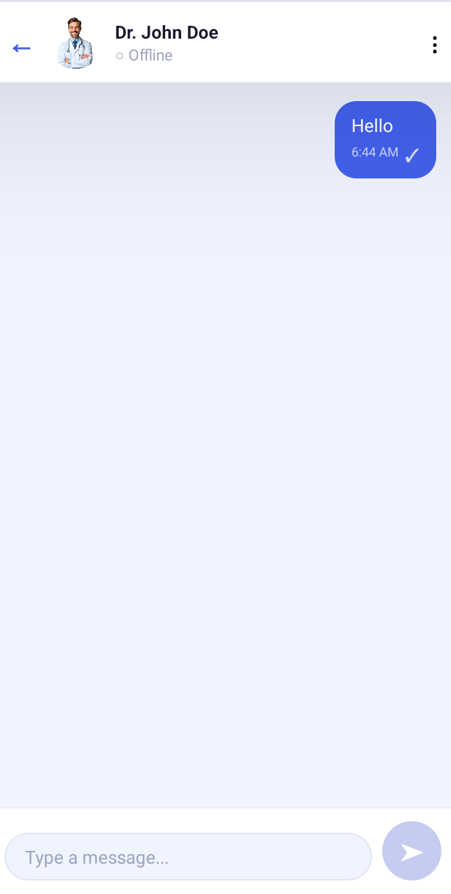
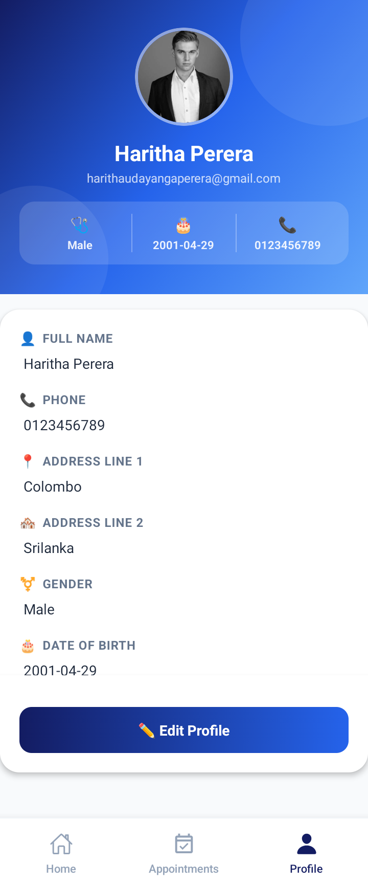
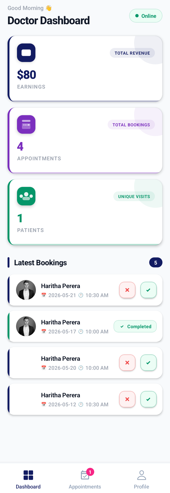
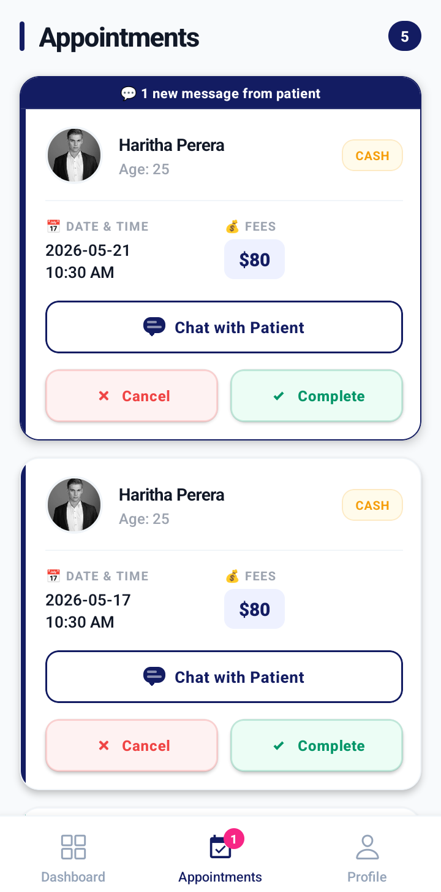
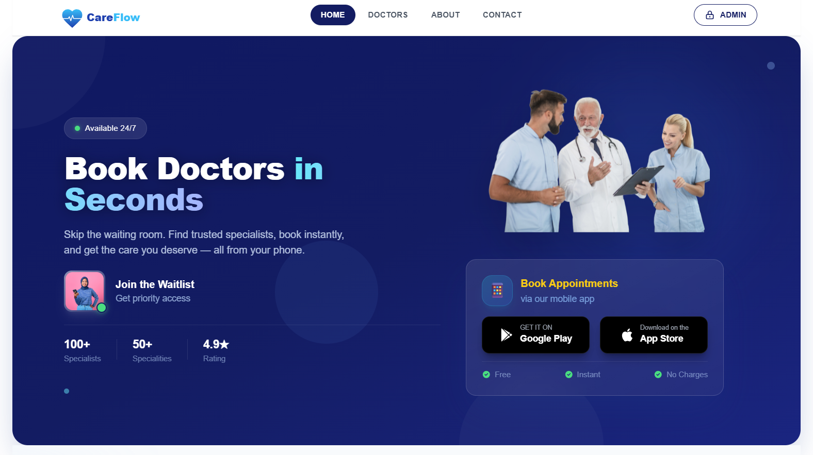
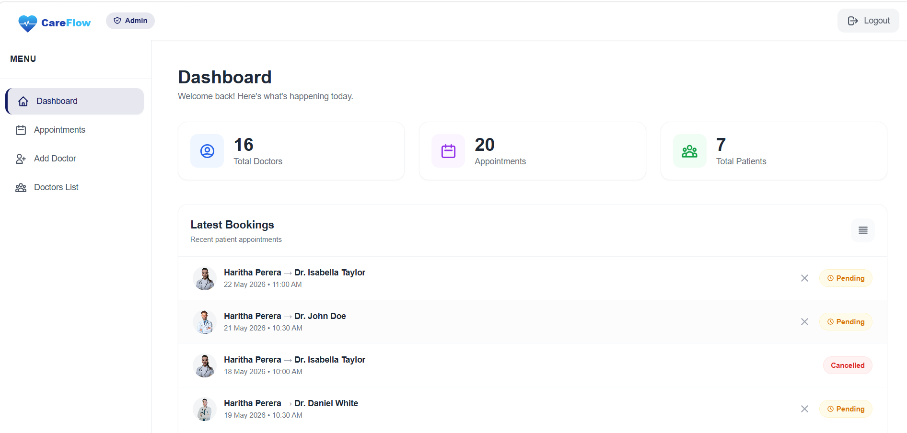

# 🏥 CareFlow – Full-Stack Healthcare Platform

CareFlow is a full-stack healthcare management platform designed to simplify appointment booking, improve communication between patients and doctors, and help administrators manage healthcare operations efficiently.

The platform includes a **React Native mobile application for patients and doctors**, an **admin-only React web application**, a Spring Boot REST API, and a Node.js real-time communication server.

## 🌐 Live Demo

| Component             | Link                                                                                                                      |
| --------------------- | ------------------------------------------------------------------------------------------------------------------------- |
| Admin Web Application | [Open CareFlow Admin](https://careflow-healthcare-system.vercel.app)                                                      |
| Android Application   | [View Android Build](https://expo.dev/accounts/haritha_123/projects/careflow/builds/ee7c1c0f-b590-424e-87dd-cf5db764286b) |
| Backend API           | [CareFlow API (Doctor List)](https://careflow-healthcare-system.onrender.com/api/doctor/list)                                                             |

**Note:** The backend is hosted on Render's free tier. The first request after a period of inactivity may take some time to respond.

## 📸 Screenshots

Screenshots demonstrate the mobile experience for patients and doctors, together with the administrator web dashboard.

### Mobile Application

| Onboarding Screen                                                | Login Screen                                           |
| ---------------------------------------------------------------- | ------------------------------------------------------ |
|  |  |


| Patient Home                                         | Appointment Booking                                          |
| ---------------------------------------------------- | ------------------------------------------------------------ |
|  |  |

| Real-Time Chat                              | Patient Profile                                   |
| ------------------------------------------- | ------------------------------------------------- |
|  |  |

| Doctor Dashboard                                             | Doctor Appointments                                                |
| ------------------------------------------------------------ | ------------------------------------------------------------------ |
|  |  |

### Admin Web Application

| Web Home                              | Admin Dashboard                                         |
| ------------------------------------- | ------------------------------------------------------- |
|  |  |

## ✨ Key Features

### 👤 Patient Features – Mobile App

* **Authentication:** Secure sign-in and authentication integration using Clerk and backend token verification.
* **Doctor Discovery:** Search for doctors and view available information.
* **Appointment Booking:** Book and manage medical appointments.
* **Appointment Management:** View appointment details and booking status.
* **Online Payments:** Integration with Stripe for supported payment workflows.
* **Real-Time Chat:** Communicate with doctors using real-time messaging.
* **Chat Indicators:** Support for features such as typing indicators and read receipts, where implemented.
* **Push Notifications:** Receive real-time appointment updates via Firebase Cloud Messaging.
* **Profile Management:** View and manage patient profile information.

### 🩺 Doctor Features – Mobile App

* **Doctor Dashboard:** Access relevant appointment and practice information.
* **Appointment Management:** View and manage assigned appointments.
* **Patient Communication:** Chat with patients through real-time messaging.
* **Profile Management:** Access and update doctor profile details.
* **Availability Management:** Toggle and update appointment availability status.

### 🛡️ Administrator Features – Web App

* **Admin Dashboard:** Access a central view of healthcare management information.
* **Doctor Management:** Manage doctor records and related information.
* **Appointment Management:** View and manage appointments.
* **Analytics:** Review available operational statistics and dashboard metrics.
* **Centralized Management:** Manage supported platform operations through the web interface.

## 🧰 Technology Stack

### Mobile Application

* **React Native** – Cross-platform mobile development
* **Expo** – Development and build tooling
* **Expo Router** – File-based navigation
* **NativeWind** – Tailwind CSS-style utilities for React Native
* **Context API** – Shared application state
* **React Query and Axios** – Data fetching and API communication
* **Socket.IO Client** – Real-time communication

### Admin Web Application

* **React** – User interface
* **Vite** – Development server and build tooling
* **Tailwind CSS** – Styling
* **React Router DOM** – Client-side routing
* **Context API** – Shared application state

### Backend REST API

* **Java** – Backend programming language
* **Spring Boot** – REST API development
* **Spring Security** – Authentication and security
* **MongoDB** – Database
* **JWT** – Token-based authentication
* **Cloudinary** – Cloud-based media management
* **Stripe Java SDK** – Payment integration
* **Rate Limiting and Security Filters** – API protection

### Real-Time Communication Server

* **Node.js** – JavaScript runtime
* **Express.js** – Server framework
* **Socket.IO** – Real-time messaging and events
* **JWT Validation** – Authentication verification through the backend API

## 🏗️ System Architecture

CareFlow separates the mobile clients, admin web application, REST API, and real-time communication service.

```text
          ┌───────────────────────────┐
          │     Mobile Application    │
          │   Patients and Doctors   │
          │    React Native + Expo    │
          └─────────────┬─────────────┘
                        │
                        ▼
          ┌───────────────────────────┐
          │     Spring Boot API       │
          │       Port: 8080          │
          │ Authentication, Business  │
          │ Logic and REST Endpoints  │
          └──────┬────────┬───────────┘
                 │        │
          ┌──────▼───┐ ┌──▼───────────┐
          │ MongoDB  │ │ Stripe and   │
          │ Database │ │ Cloudinary   │
          └──────────┘ └──────────────┘

          ┌───────────────────────────┐
          │    Admin Web Application  │
          │       React + Vite        │
          └─────────────┬─────────────┘
                        │
                        ▼
                 Spring Boot API

          ┌───────────────────────────┐
          │  Node.js + Socket.IO      │
          │       Port: 8082          │
          │   Real-Time Messaging     │
          └─────────────┬─────────────┘
                        │
                        ▼
                 Backend API
              Token Verification
```

### Architecture Overview

1. **Mobile Application:** Provides patient and doctor functionality.
2. **Admin Web Application:** Provides administrative functionality.
3. **Spring Boot Backend:** Handles REST endpoints, authentication, business logic, and database operations.
4. **MongoDB:** Stores application data.
5. **Socket.IO Server:** Supports real-time communication.
6. **External Services:** Stripe supports payment workflows, while Cloudinary supports media management.

## 📂 Project Structure

```text
CareFlow/
│
├── mobile/
│   ├── app/
│   │   ├── (auth)/
│   │   ├── (common)/
│   │   ├── (doctor)/
│   │   └── (patient)/
│   ├── api/
│   │   └── server.js
│   ├── src/
│   │   ├── api/
│   │   ├── components/
│   │   ├── context/
│   │   ├── data/
│   │   └── utils/
│   └── package.json
│
├── web/
│   ├── src/
│   │   ├── components/
│   │   ├── context/
│   │   └── pages/
│   └── package.json
│
├── backend/
│   ├── src/
│   │   └── main/
│   │       └── java/
│   │           └── com/
│   │               └── medical/
│   │                   └── careflow/
│   │                       ├── config/
│   │                       ├── controller/
│   │                       ├── dto/
│   │                       ├── exception/
│   │                       ├── model/
│   │                       ├── repository/
│   │                       ├── service/
│   │                       └── util/
│   └── pom.xml
│
├── screenshots/   
│
└── README.md
```

## ⚙️ Getting Started

### Prerequisites

Node.js, Java JDK 17+, Maven, MongoDB, and Expo tooling.

### 1. Backend (Spring Boot)

```bash
cd backend
# Configure application.yml with MongoDB URI, JWT secret, Stripe and Cloudinary keys
mvn spring-boot:run
```

### 2. Real-Time Server (Node.js)

```bash
cd mobile/api
npm install
# Create .env with SPRING_BOOT_URL=http://localhost:8080
npm start
```

### 3. Web App (React + Vite)

```bash
cd web
npm install
# Create .env with the backend URL expected by the frontend
npm run dev
```

### 4. Mobile App (Expo)

```bash
cd mobile
npm install
# Configure EXPO_PUBLIC_API_URL, EXPO_PUBLIC_SOCKET_URL, and Clerk keys
npx expo start
```

**Note:** Use the environment variable names expected by your actual source code. Keep secrets in local environment files and never commit them to GitHub.

## 🔐 Security Considerations

CareFlow includes security-related mechanisms such as:

* Token-based authentication.
* Backend authentication and authorization.
* JWT verification for protected operations.
* API rate limiting.
* Backend utilities strip malicious inputs before database insertion.
* Security headers and protected endpoints.
* Payment processing through Stripe integrations.
* Environment-based configuration for sensitive values.

## 💡 Future Improvements

Potential improvements include:

* Appointment reminders and enhanced notification workflows.
* More detailed administrative analytics.
* Improved appointment scheduling and availability management.
* Additional automated testing and API documentation.
* Improved accessibility and responsive layouts.
* Enhanced deployment monitoring and error reporting.

These are potential enhancements and should not be interpreted as already implemented features.

## 🎯 Project Purpose

CareFlow aims to make healthcare appointment management more convenient by connecting patients, doctors, and administrators through a shared platform.

The project brings together mobile development, web development, REST API design, authentication, database management, payment integration, and real-time communication in one full-stack system.

## 👨‍💻 Author

**Haritha Perera**

Computer Science Undergraduate
University of Sri Jayewardenepura, Sri Lanka

## 📄 License

All rights reserved.

This repository is intended for demonstration and portfolio purposes. Contact the author for permission before redistributing or reusing the project.

---

⭐ If you find this project interesting, feel free to explore the repository and its implementation.


